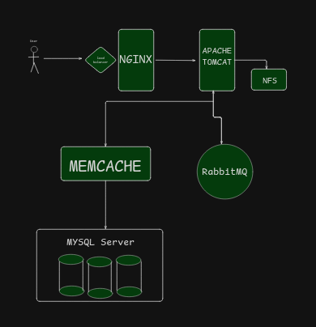

# DEVOPS-STACK-ADAPT  

**Projeto educativo de DevOps** que adapta um stack originalmente em Java (NGINX + Apache Tomcat + RabbitMQ + Memcached + MySQL) para Python/Django, mantendo os mesmos conceitos de integração de serviços.  

## 🔧 Stack Original vs. Adaptação  
| **Componente**  | **Stack Original (Java)** | **Stack Adaptado (Django)** |  
|----------------|--------------------------|---------------------------|  
| **Servidor Web** | NGINX + Apache Tomcat    | NGINX + Gunicorn           |  
| **Mensageria**  | RabbitMQ (Java)          | RabbitMQ + Celery (Python) |  
| **Cache**       | Memcached                | Memcached (via Django)     |  
| **Banco de Dados** | MySQL                  | MySQL (Django ORM)         |  

## 🎯 Objetivo  
- Aprender configuração de infraestrutura com NGINX, mensageria, cache e BD.  
- Demonstrar como migrar um stack Java para Django sem perder os conceitos fundamentais.  

## 📂 Estrutura do Repositório  
```plaintext
/  
├── vagrant/                  # Configurações de VMs (original + adaptação)  
├── django-app/               # Código-fonte da adaptação em Django  
├── java-app/                 # Código-fonte original (opcional)  
├── diagrams/                 # Diagramas do projeto original e adaptado  
└── infra/                    # Configurações de NGINX, MySQL, etc.  
```

## Diagrama do Stack (JAVA)
